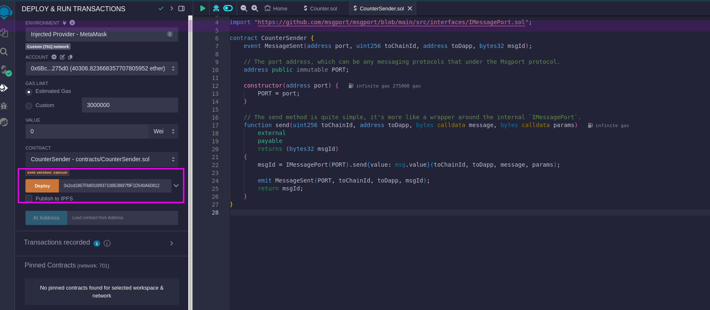
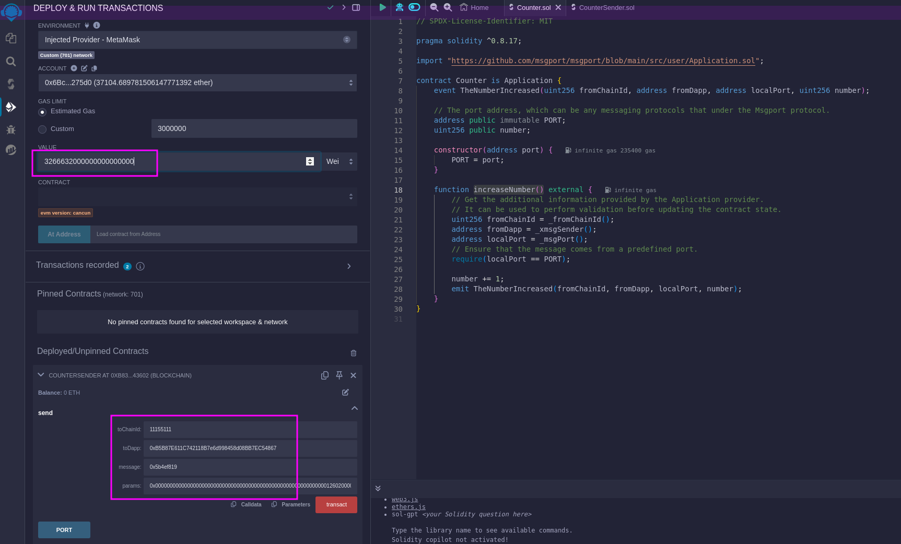

# Sending Messages Using Remix

In this guide, we'll walk you through the process of **sending cross-chain messages from the [Darwinia Koi testnet](https://docs.darwinia.network/build/getting-started/networks/koi/) to the Ethereum Sepolia testnet** using the msgport protocol with [Remix](https://remix.ethereum.org/). No extensive smart contract development expertise is necessary — as long as you're familiar with deploying and interacting with Solidity smart contracts in Remix, you'll be able to follow along. Let's dive in!

## Prerequisites

### Get Koi Test Token

Before we proceed, it's important to understand that in our cross-chain communication, the Koi network serves as the source chain while the Sepolia network acts as the destination chain. It's crucial to have this distinction in mind. According to the msgport design, the fee for sending a cross-chain message is paid using the source chain's native token, which in this case is the Koi testnet token. Therefore, you'll need to acquire some test tokens beforehand. To do so, please use [the provided faucet](https://faucet.triangleplatform.com/darwinia/koi) and ensure you add the Koi network to your Ethereum wallet, such as MetaMask.

### Understand The Counter Contract

For ease of understanding, we'll be working with an existing contract on the Sepolia network named **`Counter`**. You can find the contract details at [Sepolia Etherscan](https://sepolia.etherscan.io/address/0xb5b87e611c742118b7e6d998458d08bb7ec54867). The contract has a straightforward design; it includes a variable named **`number`** and offers a method to increment its value.

```solidity linenums="1" title="Counter.sol"
// SPDX-License-Identifier: MIT

pragma solidity ^0.8.17;

import "https://github.com/msgport/msgport/blob/main/src/user/Application.sol";

contract Counter is Application {
    event TheNumberIncreased(uint256 fromChainId, address fromDapp, address localPort, uint256 number);

    // The port address, which can be any messaging protocols that under the Msgport protocol.
    address public immutable PORT;
    uint256 public number;

    constructor(address port) {
        PORT = port;
    }

    function increaseNumber() external {
        // Get the additional information provided by the Application provider.
        // It can be used to perform validation before updating the contract state.
        uint256 fromChainId = _fromChainId();
        address fromDapp = _xmsgSender();
        address localPort = _msgPort();
        // Ensure that the message comes from a predefined port.
        require(localPort == PORT);

        number += 1;
        emit TheNumberIncreased(fromChainId, fromDapp, localPort, number);
    }
}
```

The contract at address **`0xB5B87E611C742118B7e6d998458d08BB7EC54867`** will serve as the destination in this tutorial. We will demonstrate how to increase the **`number`** variable by calling the **`increaseNumber()`** function through a cross-chain message from the Koi network in the upcoming steps.

## Send Message From Koi

### Prepare The CounterSender Contract

Create a new Solidity file named **`CounterSender.sol`** and copy the contract code provided into it. Ensure that it compiles successfully without any errors.

```solidity linenums="1" title="CounterSender.sol"
// SPDX-License-Identifier: MIT
pragma solidity ^0.8.17;

import "https://github.com/msgport/msgport/blob/main/src/interfaces/IMessagePort.sol";

contract CounterSender {
    event MessageSent(address port, uint256 toChainId, address toDapp, bytes32 msgId);

    // The port address, which can be any messaging protocols that under the Msgport protocol.
    address public immutable PORT;

    constructor(address port) {
        PORT = port;
    }

    // The send method is quite simple, it's more like a wrapper around the internal `IMessagePort`.
    function send(uint256 toChainId, address toDapp, bytes calldata message, bytes calldata params)
        external 
        payable 
        returns (bytes32 msgId)
    {
        msgId = IMessagePort(PORT).send{value: msg.value}(toChainId, toDapp, message, params);

        emit MessageSent(PORT, toChainId, toDapp, msgId);
        return msgId;
    }
}
```

### Deploy The CounterSender

After successfully compiling **`CounterSender.sol`**, the next step is to deploy it on the Koi testnet. Switch your wallet to the Koi network, if you need information on how to do this, consult the [network details](https://docs.darwinia.network/evm/chains/overview/). The contract requires a parameter for the constructor **`address port`**, which is the address of the ORMP port, a constant across all networks. Enter **`0x2cd1867Fb8016f93710B6386f7f9F1D540A60812`** as the parameter and click the deploy button to deploy the contract on the Koi testnet. To monitor the transaction status, you may also visit the [Koi Scan](https://koi-scan.darwinia.network/).




### Send Message



The most thrilling part of the process is invoking the **`send(uint256 toChainId, address toDapp, bytes calldata message, bytes calldata params)`** method on the CounterSender contract, which will initiate the cross-chain message transmission. The parameters for this call are somewhat complex, so let's break them down for clarity:

1. value: `3266632000000000000000`
    - The cross-chain message fee. You can easily get the value from the [Msgport API](../api.md) for the given inputs.
2. toChainId: **`11155111`**
    - The Sepolia chain ID.
3. toDapp: **`0xB5B87E611C742118B7e6d998458d08BB7EC54867`**, 
    - The address of the existing Counter contract on Sepolia.
4. message: **`0x5b4ef819`**
    - This is the encoded function call for **`increaseNumber()`**.
5. params:`0x00000000000000000000000000000000000000000000000000000000000126020000000000000000000000006bc9543094d17f52cf6b419fb692797e48d275d000000000000000000000000000000000000000000000000000000000000000600000000000000000000000000000000000000000000000000000000000000000`
    - The additional parameters for sending message. You can easily get the value from the [Msgport API](../api.md). 

After setting up the required parameters, proceed to click the transact button to execute the **`send`** method, which will send the cross-chain message to Sepolia. Remember to note down the transaction hash `0x1fb1faa75c25ac00e5edb3fdff20b5d5bb2d4969576fc375a5855d789a2d5511` that appears in the Remix debug panel. We'll use this hash to track the status of the cross-chain operation in the following step.

## Check Message Status

A [msgport scan](../scan.md) available to monitor the status of cross-chain messages, offering the ability to index messages by either the source chain transaction hash or the msgId. Typically, querying with the transaction hash is the most convenient approach.

## Check In The Counter

When the message status indicator turns green and shows **success**, it signifies that the cross-chain message process has been completed. At this point, you can verify the **`Counter`** contract to confirm that the **`number`** value has incremented, or you can examine the [contract's events](https://sepolia.etherscan.io/address/0xB5B87E611C742118B7e6d998458d08BB7EC54867#events) for confirmation.
