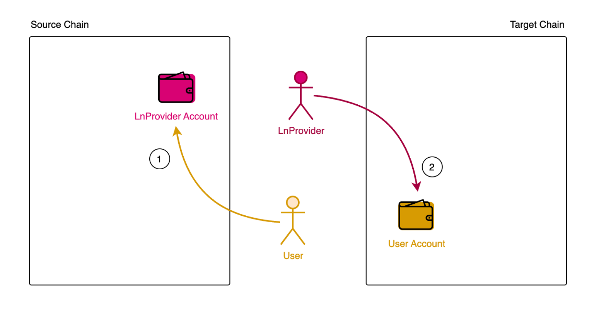

# Order XClearing

Many use cases involve order clearing, such as order book DEXs, swap DEXs, equivalent swap, NFT markets, and more. These use cases can all be extended to cross-chain scenarios. Helix Bridge is one such example. It is a third-party token bridge that allows users to perform cross-chain swaps with liquidity relayers, serving as permissionless order takers and makers, essentially facilitating order based cross-chain equivalent swap. 

For example, [Helix Bridge](https://helixbridge.app/) leverages [Msgport](../../learn/index.md) to do settements after users taking orders of liquidity relayer. Msgport can deliver messages indicating that whether liquidity relayer fullfill user's order successfullly or not, where truth of messages are verified by the underlining message protocols Msgport are integrating.

!!! Quote
    The advantage of using `Msgport` is that it is very easy to switch between different low-level message layers without making big changes to the code. — Helix Bridge

## Helix Bridge Introduction

Compared to [xToken bridge](./xtoken.md), Helix Bridge stands out for its exceptionally low cross-chain fees, enabled by its capacity for batch clearing through Msgport after accumulating several orders.

The Helix Bridge protocol introduces a permissionless system for liquidity relayers to place orders. When users swap tokens between two chains, they select an order from a liquidity relayer offering favorable terms, including fees and transfer limits. The tokens are then sent to the Helix Bridge contract, where they await being fullfilled by relayer on target chain. Upon detecting a swap event, the liquidity relayer's node initiates the transfer of an equivalent amount of tokens to the user on the target chain, using a clearing contract that records the order match. To clear and withdraw funds from the source chain, the liquidity relayer merely needs to send a message through Msgport from the target chain to clear their matched orders.

Should a liquidity relayer fail to fulfill the order promptly, a "slasher" can step in to complete the order. This action is recorded in the clearing contracts. Slashers can trigger a claim against the liquidity relayer's penalty reserve by sending penalty-related clearing messages. Settlement occurs when the liquidity relayer attempts to withdraw from the penalty reserve, also through a message-sending process.

## Summary
Msgport plays a pivotal role in Helix Bridge by enabling efficient batch clearing and communication for liquidity relayers, leading to significantly reduced cross-chain fees. It allows for the seamless execution of orders and the swift resolution of disputes through the intervention of "slashers" when orders are not fulfilled as expected. Beyond token swaps, the flexibility and efficiency of Msgport can be extended to a wide range of use cases in cross chain orders senarios.

## Reference

1. https://docs.helixbridge.app/helixbridge/liquidity_node_v3